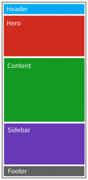
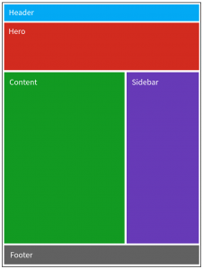
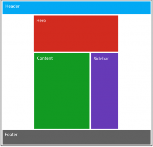
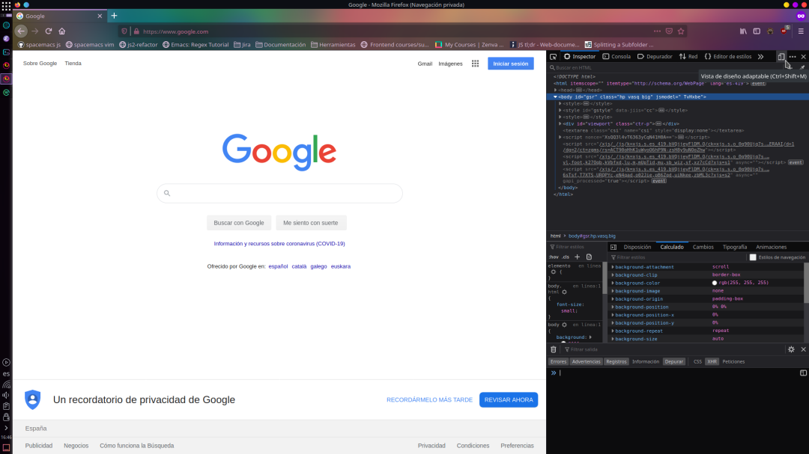
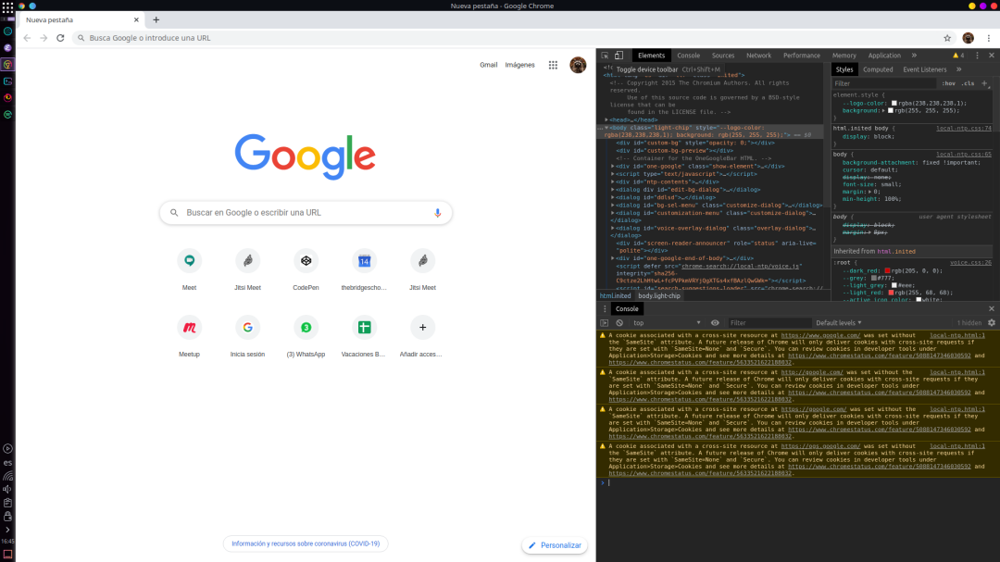
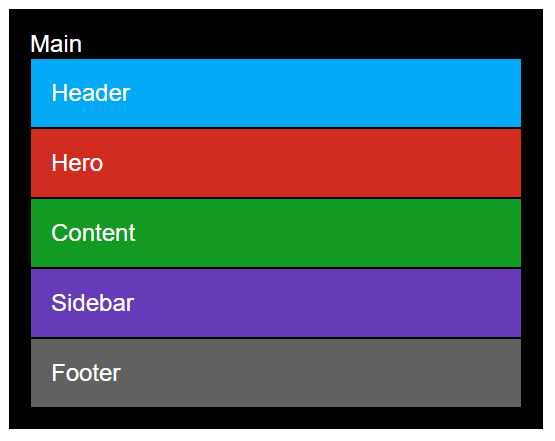
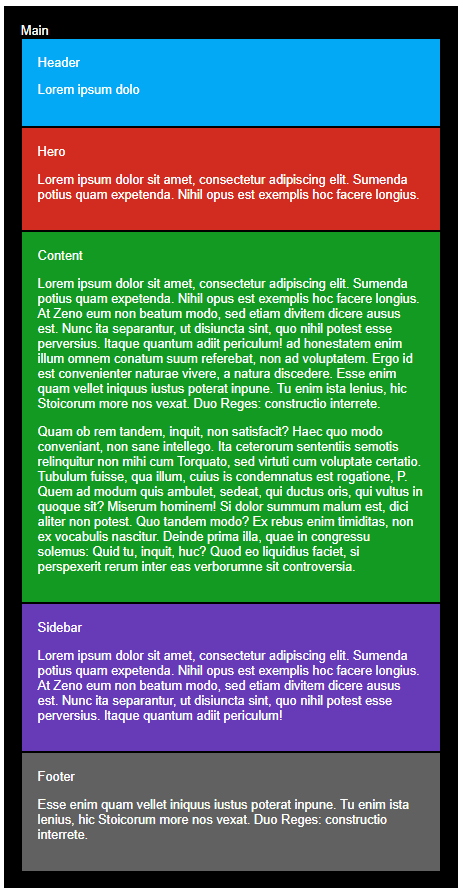
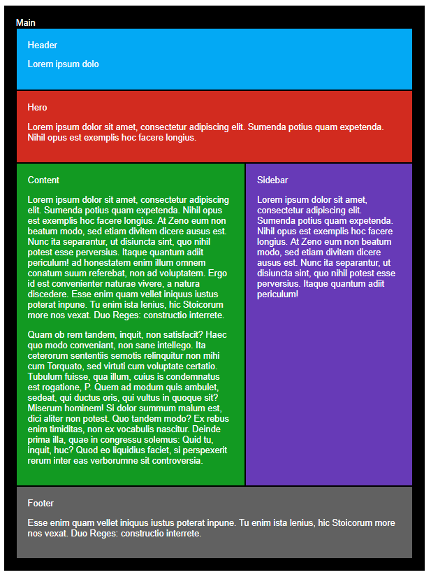
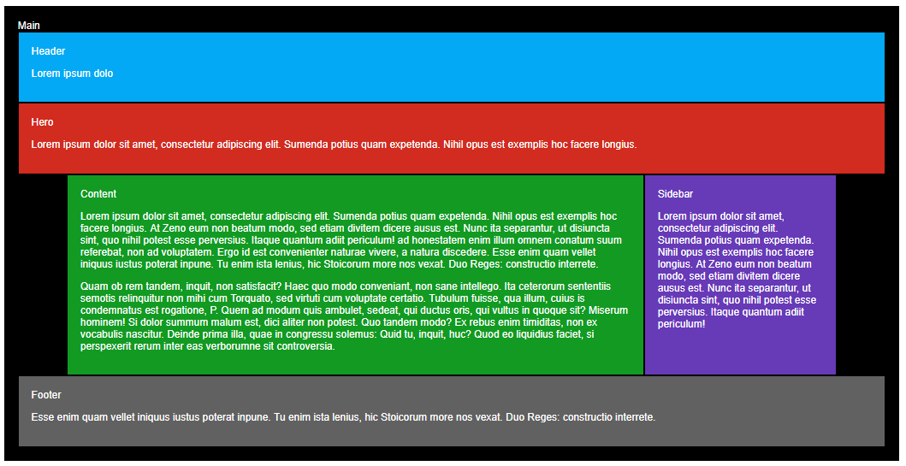

# :crossed_swords: Responsive  #

## Introducción ##

Haremos una página completamente "responsive", o con diseño adaptable, con la estrategia o aproximación de "mobile first", que no es otra cosa que realizar el diseño para móvil inicialmente, e ir extendiendo la programación hacia resoluciones o tamaños de pantalla mayores.

Móvil:

Tablet:

Escritorio:

## Requisitos ##

- HTML5

- CSS3

Comenzaremos a hacer nuestro diseño desde el móvil, así que habrás de poner tu navegador en modo "responsive" a través de las "Developer Tools":

Firefox:

Chrome:

## Iteraciones ##

### Móvil ###

1. Crea toda la estructura HTML

    Agrega todo el contenido y dótalo de una estructura semántica completa.

2. Añade estilos básicos de CSS para ayudarnos al desarrollo.

    Agrega colores, como los modelos que te proponemos y así te resultará más fácil ver el tamaño de los bloques, así como su comportamiento.

    

3. Incluye texto de relleno que nos ayude también al desarrollo.

   [Chiquito Ipsum](http://www.chiquitoipsum.com) como ayuda.

   En este paso, el texo nos ayudará a ampliar el comportamiento de los bloques, y ajustar posteriormente para que nunca haya casos "extremos" en los que se vea incorrectamente

   

### Tablet ###

4. Agregaremos nuestro primer punto de ruptura, a elegir, para añadir los estilos para el diseño de tablet.

### Escritorio ###

5. Crearemos el punto de ruptura para escritorio y añadiremos los estilos pertinentes.

    Tendrás que envolver en un bloque para poder darle un ancho determinado y centrar.

    
